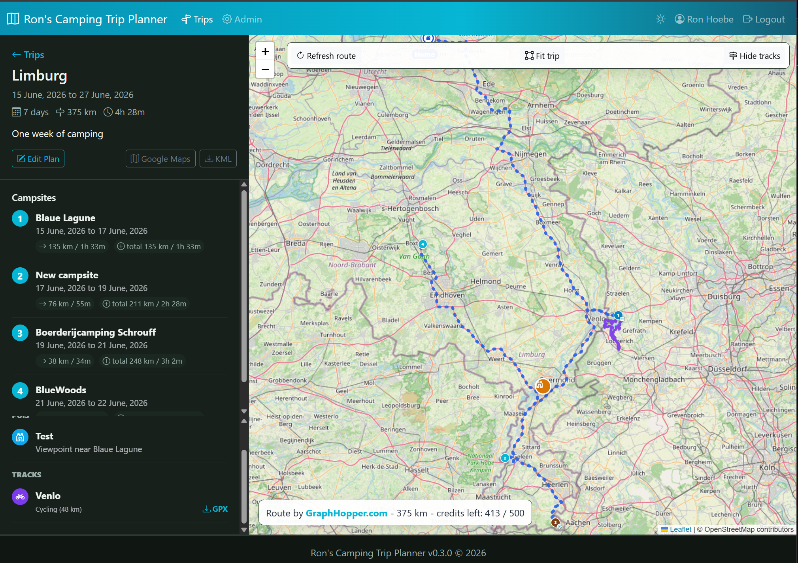

# Camping Trip Planner


A small Flask app for planning camping trips with dated campsites, POIs, GPX cycling/hiking tracks, automatically synced campground data, and a Leaflet map.



## Features

- Plan trips with dated campsites and route metrics.
- Show a calculated route on a Leaflet/OpenStreetMap map.
- Add manual POIs with category icons.
- Upload GPX tracks or routes, mark them as cycling or hiking, show them on the map, and download the original GPX.
- Import campsite/caravan-site data from `GpxFeed/campgrounds`.
- Export trips as KML and open the campsite route in Google Maps.
- Admin area for trips, stops, POIs, tracks, users, settings, and campground data updates.

## Local Run

```bash
git clone https://github.com/RAHoebe/camping-trip.git
cd camping-trip
pip install -r requirements.txt
python app.py
```

Open `http://127.0.0.1:8034`.

On first run, an admin account is created:

- Username: `admin`
- Password: `change-me-please`

Override this with `DEFAULT_ADMIN_USERNAME`, `DEFAULT_ADMIN_PASSWORD`, and `DEFAULT_ADMIN_EMAIL`. Change the default password before exposing the app outside your local machine.

## Routing

Default routing is GraphHopper-compatible:

```text
ROUTE_PROVIDER=graphhopper
```

Create `graphhopper.key` in the project folder and paste only the API key in that file. It is ignored by git and Docker builds.

You can also set the key directly in PowerShell before starting:

```powershell
$env:ROUTE_PROVIDER="graphhopper"
$env:GRAPHHOPPER_API_KEY="your-key-here"
python app.py
```

`run_local.cmd`, `run_waitress.cmd`, and `run_docker.cmd` read `graphhopper.key` automatically. For Docker, `run_docker.cmd` passes the key to the container as the `GRAPHHOPPER_API_KEY` environment variable.

For OSRM:

```text
ROUTE_PROVIDER=osrm
OSRM_BASE_URL=https://router.project-osrm.org
```

Routes are calculated between campsites in arrival-date order. Manual POIs and uploaded GPX tracks are displayed on the map but do not affect the calculated campsite route.

The app caches each route leg separately. When you refresh a larger trip, unchanged legs are reused and new GraphHopper calls are spaced out to avoid the minutely API limit:

```text
GRAPHHOPPER_LEG_DELAY_SECONDS=8
GRAPHHOPPER_429_RETRY_SECONDS=65
GRAPHHOPPER_429_RETRIES=1
ROUTE_LEG_CACHE_HOURS=24
```

## Campground Data

The app can check `GpxFeed/campgrounds` and import campsite/caravan-site GPX files from `gpx-stripped`. It stores the GitHub commit SHA and refreshes when a newer commit is available.

Control this with:

```text
GPXFEED_AUTO_UPDATE=true
GPXFEED_UPDATE_INTERVAL_HOURS=24
```

Admins can also force an update from `Admin -> Campground Data`.

## Docker / NAS Deployment

See [DeploySynologyNAS.md](DeploySynologyNAS.md) for Docker, Portainer, Synology NAS, and reverse proxy notes.

## Credits And Attribution

Camping Trip Planner is built on top of several excellent projects and services:

- [GpxFeed/campgrounds](https://github.com/GpxFeed/campgrounds) for open campground GPX data.
- [GraphHopper](https://www.graphhopper.com/) for routing when `ROUTE_PROVIDER=graphhopper`.
- [OSRM](https://project-osrm.org/) as an optional OSRM-compatible routing backend.
- [OpenStreetMap](https://www.openstreetmap.org/copyright) contributors for map data.
- [Leaflet](https://leafletjs.com/) for interactive maps.
- [Flask](https://flask.palletsprojects.com/), [Bootstrap](https://getbootstrap.com/), and [Bootstrap Icons](https://icons.getbootstrap.com/) for the web application foundation.

Use of third-party data and services may be subject to their own licenses, attribution requirements, API keys, rate limits, and terms.

## Release Version

The current app version is stored in `version.txt` and shown in the footer. Admins can enable a Docker Hub update check in `Admin -> Options`.

To create a GitHub release for the current version:

```cmd
release_github.cmd
```

Or pass a tag explicitly:

```cmd
release_github.cmd v0.1.1
```

## License

This project is licensed under the MIT License. See [LICENSE](LICENSE).
